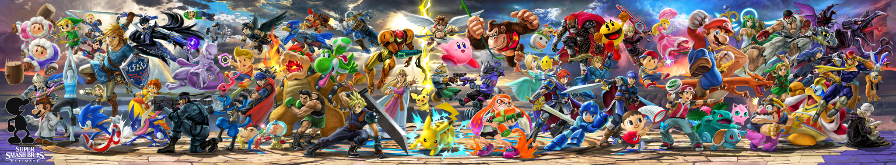

# 👋 Hey, I'm Esteban!

I'm currently a third-year **Computer Science student** (L3), on my way to pursuing a Master's degree soon. Passionate about **coding**, **game development**, and **AI**, I love diving into challenging projects that push my skills and creativity. Whether I'm building web apps, exploring machine learning, or crafting game mechanics in **Godot**, I'm always learning and growing.

I'm a huge fan of indie games, my favorite games of all time are **Celeste**, **Hollow Knight** and **Super Smash Bros Ultimate**. I love modding video games and I already made several ones for **Super Smash Bros Ultimate**.

This GitHub is where I showcase my journey—projects, experiments, and tools I've worked on. I'm always open to collaboration and new ideas, so feel free to reach out if you'd like to connect!

Thanks for visiting, and I hope you enjoy exploring my work! 😊

## 📋 Languages/Frameworks/SDK
||||
|:---:|:---:|:---:|
|   ⭐⭐⭐⭐ |    ⭐⭐⭐⭐ |    ⭐⭐|
|   ⭐⭐ |    ⭐⭐⭐ |    ⭐⭐⭐|
|   ⭐⭐ |    ⭐⭐⭐⭐ |    ⭐⭐⭐|
|   ⭐⭐ |    ⭐⭐ |    ⭐⭐|
|   ⭐⭐ |    ⭐ |    ⭐|

## 🖥️ IA/ML/DL

<!--Apprendre

-->

## 💻 IDEs/Editors

## 🎨 Design Tools

## 📚 Frameworks, Platforms and Libraries
|||
|:---:|:---:|
|   ⭐⭐⭐ |    ⭐⭐⭐⭐|
|   ⭐⭐⭐ |    ⭐⭐⭐|
|   ⭐⭐ |    ⭐⭐|
|   ⭐⭐⭐ |    ⭐⭐⭐|
|   ⭐⭐ |    ⭐⭐⭐|

## 🎮 Game Engine

## Operating System

## 💾 Databases

## 🏢 Office

## 🕓 Version Control & Collaboration Tools

<!--
## 📊 GitHub Stats

## 🛠️ Projets
- [Projet IA](https://github.com/esteban/mon-projet-ia) : Un projet d'intelligence artificielle.
- [Portfolio en ligne](https://github.com/esteban/portfolio) : Mon portfolio en ligne conçu avec Django.

## 🚀 Projets épinglés

## 🎯 Learning Goals
- 🌱 Currently learning **Godot**.
- 🔭 Exploring **Game Development** with **Godot**.

## 🤝 Collaboration
- 👯 I'm open to collaborating on **AI**, **game development**, and **web-based projects**.
- 💬 Feel free to reach out if you're working on something exciting, or if you'd like to share ideas or ask questions!
-->

## 💬 Contact

<!--

-->

-------------------------------

